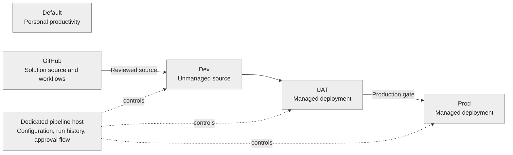

# Designing a Power Platform lab with guardrails, not lockdown

*A reusable architecture note for platform teams building a customer-facing Power Platform and Copilot Studio demonstration lab.*

## The problem: demos need freedom, but tenants need boundaries

A demo tenant is pulled in two directions. Makers need to try connectors, Copilot Studio, preview capabilities, and rapid changes in front of a customer. Administrators need to prevent an experiment from becoming an accidental production integration, an uncontrolled sharing event, or a tenant-wide exception. A single general-purpose environment cannot make those boundaries clear.

This design gives each kind of work a visible home. It keeps the maker experience broad inside nonproduction while creating distinct production controls and a repeatable path between environments. The goal is a lab that is easy to explain and reset, not a blanket lockdown that prevents useful demonstrations.

## The environment model

| Area | Recommended posture | Why it is useful |
|---|---|---|
| Default | Personal productivity only; restrict broad sharing and uncontrolled creation. | Default is created for tenant convenience, not as the team's release environment. Treating it as a personal workspace limits production-like dependence on it. |
| Dev | Sandbox with Dataverse; makers can build and experiment; solution source remains unmanaged. | Makers need a fast feedback loop. Keeping source in Dev supports familiar solution authoring and export. |
| UAT | Sandbox with Dataverse; restrict maker access; deploy managed artifacts; validate integrations and scenarios. | UAT makes a release review visible and catches environment-specific configuration before production. |
| Prod | Production environment with Dataverse; managed deployment; strict DLP and restricted roles; approval before release. | Production receives reviewed changes through one auditable path. |
| Pipeline host | Dedicated environment with Dataverse and the Power Platform Pipelines app. | It isolates pipeline configuration and history. A custom host also supports the platform's pre-deployment extension used for approval logic. |

Microsoft recommends that production/target environments in a pipeline be Managed Environments and describes the host as the storage and management plane for pipeline configuration, security, and history. A dedicated host also reduces coupling between the deployment control plane and app workloads. See [custom pipeline hosts](https://learn.microsoft.com/power-platform/alm/custom-host-pipelines).

## Why groups form the access boundary

Create role groups for administrators, makers, and approvers, then assign those groups to environments, Dataverse roles, and pipeline permissions. Keep group membership in Entra ID so customer administrators can change membership without editing every environment. An umbrella environment-access group can make environment access easier to scope, but verify nested-group behavior in the tenant before relying on it as a hard boundary.

Use role separation as a default:

- **Admins** administer environment settings, Dataverse, and the pipeline host.
- **Makers** build in Dev, validate in UAT when necessary, and have no routine production maker role.
- **Approvers** can review the release request without authoring the solution being approved.

For a real production control, the approver should be independent of the person who made the change. A demo with one person in all three groups demonstrates the mechanics of a gate, but not meaningful separation of duties.

## Why three DLP scopes beat one giant policy

Use three explicit policy scopes: Default productivity, NonProd demo flexibility, and Prod guardrails. In NonProd, classify the connectors needed for demos so makers can show realistic integrations while keeping the policy's Business/Non-business boundary understandable. In Prod, allow only the reviewed connectors needed by deployed workloads and classify everything else as non-business or blocked according to tenant policy.

Policy names and connector groups do not prove a policy is safe. Review the actual connector classifications, custom connector rules, and policy precedence in PPAC. Avoid assuming connector inventory or licensing is identical between tenants. Keep the pipeline host's scope deliberate: the host may run administrative flows that need a separate risk review.

## Keep AI and previews available with explicit controls

Leave Copilot Studio and preview features enabled in the demo estate unless a specific legal, data handling, residency, or security requirement justifies disabling one. Constrain the risk around those capabilities instead: require Entra authentication, limit authoring and sharing to groups, keep nonproduction data synthetic, and review connectors and transcript retention separately in each environment. This lets the team demonstrate current features without treating production data as demo material.

Preview capabilities can change and may have different support guarantees. Reassess them as part of periodic governance review rather than turning them off by default.

## ALM: Git holds source; Power Platform Pipelines controls promotion

Keep unpacked unmanaged solution source in Git. Use pull requests to review changes and build an immutable package from the reviewed revision. Import source into Dev, then promote through the native Power Platform pipeline into UAT and Prod. The native pipeline exports the solution artifact and reuses that artifact across subsequent stages; this is the mechanism that preserves a consistent release through the stages.

Production receives two checks in this starter pattern:

1. GitHub's protected `prod` Environment can require a human reviewer before the release workflow proceeds.
2. The Power Platform pipeline's Prod stage can require a custom pre-deployment step. A flow in the custom host gathers approval and calls the matching pipeline status action to complete or reject the pending step.

The Power Platform gate remains the tenant-side deployment control. GitHub's gate protects access to the workflow and repository release path. Neither should be represented as independent separation of duties if the same person can approve their own change.

## The small sample artifact

`solutions/LabPipelineDemo` is an intentionally minimal unmanaged solution skeleton generated with PAC CLI. It gives a customer a stable solution identity and publisher prefix to personalize. Add one small Dataverse table or app in Dev, export and unpack it, and commit the generated source before using the release workflow. The blank seed package by itself proves packaging, but a meaningful demo should include a component that a reviewer can see in UAT after promotion.

The existing tenant's sample solution is not embedded here. A tenant export is tenant-specific and must be deliberately exported, scrubbed of environment-specific values, and reviewed before committing it to a reusable customer repository.

## Reset and redeploy

Rebuild by applying the parameter manifest, provisioning the environments and groups, configuring policies and environment groups, installing the pipeline host application, importing the approval-flow solution, and recreating the pipeline stages. Then connect GitHub Actions and deploy the solution through the pipeline. Record environment IDs, stage IDs, DLP classifications, connection references, group object IDs, and any exception approvals in the customer's secured operations record.

Some tenant-wide controls and pipeline configuration are admin-center tasks or use interfaces whose support level varies. This repository intentionally marks these as guided tasks instead of hiding them behind an undocumented API and claiming full automation. The implementation can be extended for a tenant after the supported APIs and privilege scope are verified.

## References

- [Power Platform ALM basics](https://learn.microsoft.com/power-platform/alm/basics-alm)
- [GitHub Actions for Microsoft Power Platform](https://learn.microsoft.com/power-platform/alm/devops-github-actions)
- [Configure pipelines using a custom host](https://learn.microsoft.com/power-platform/alm/custom-host-pipelines)
- [Extend pipelines with custom approval steps](https://learn.microsoft.com/power-platform/alm/extend-pipelines)
- [PAC pipeline commands](https://learn.microsoft.com/power-platform/developer/cli/reference/pipeline)
- [Copilot Studio ALM guidance](https://learn.microsoft.com/microsoft-copilot-studio/guidance/alm)

